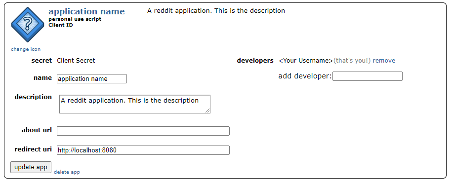

# reddittz
A reddit osint command line application.

<p align="center">

</p>

### Table of contents

- [Installation](#installation)
- [Start](#start)
- [Usage](#usage)
- [To-do](#to-do)


# Installation


Clone the github repo
```
$ git clone https://github.com/georgehawkins0/reddittz.git
```
Change Directory

```
$ cd reddittz
```
Install requirements
```
$ python3 -m pip install -r requirements.txt
```

# Start
## Creating a reddit account
To use this application you must need a reddit api app, which requires a reddit account. 
Go to https://www.reddit.com/register/ to make an account.
## Creating a reddit api app

Go to https://www.reddit.com/prefs/apps/ . Click on “create an app" at the bottom. Choose a name, then select script. For redirect URI use http://localhost:8080. Click create app.

You will be presented with this

 </img>

Client ID is below the name at the top left. Client secret is just below that.

Inside ./creds/creds.yml, you must fill out client_id, client_secret, and the username, password of the reddit account that you made this application on.


# Usage

Target's username is entered via --username 

Here are some usage examples

1. Find timezone of u/spez by comment post time

        $ reddittz.py -u spez -f

2. Find timezone of u/spez by comment post time, and show frequency graph

        $ reddittz.py -u spez -f -d

3. Show u/spez top 30 most used words

        $ reddittz.py -u spez -w -a 30

4. Show top 10 words that are deemed spelt incorrectly by u/spez by PyEnchant

        $ reddittz.py -u spez -s -a 10

    note that by default the dictionary used is en-US

5. Find emails commented by u/spez

        $ reddittz.py -u spez -e

## Args list:

```   -h, --help            show this help message and exit
  -u USERNAME, --username USERNAME
                        The target reddit username.
  -f, --frequency       Display frequency graph
  -w, --word            Show most commonly used words.
  -d, --display         Display hour frequency graph
  -p, --percent         Display percentages on the hour frequency graph
  -a AMOUNT, --amount AMOUNT
                        How many of the top n are displayed. For use in args.word and args.spelling.
  -s, --spelling        Show commonly misspelled words by user using PyEnchant.
  -dc DICTIONARY, --dictionary DICTIONARY
                        The dictionary to check words against
  -e, --email           Show email addresses commented by a user.
  ```


# Comments OSINT

Due to reddit praw API restrictions, only 1000 of a users comments can be fetched.

## Frequency

This command generates a frequency per hour of comment submission time. Using this, it tries to work out the timezone of a user by taking into account human sleep. However everone has different lifestyles and as such this command is probably only accurate +/-3 hours, maybe more. However it is still useful as an insight. You can make it display a frequency graph with --display. 

## Words

Show most commonly used words by a user.


## Spelling

Each word used by the target is fed into PyEnchant. This is useful for finding idiosyncratic typing errors by an individual. This will also pick up slang that a user uses. Furthermore, as this will pick up on words that are deemed spelt incorrectly, terms used by esoteric groups that are not in the official dictionary will be picked up. *Note: This is still in beta.*

## Email

Searches for email addresses commented by target user.


# To-do

By default the api only allows you to fetch 1000 comments. There are some workarounds which I have not looked into yet.

Spelling (Note: in beta) will auto flag a subreddit mention as an incorrectly spelled word.
